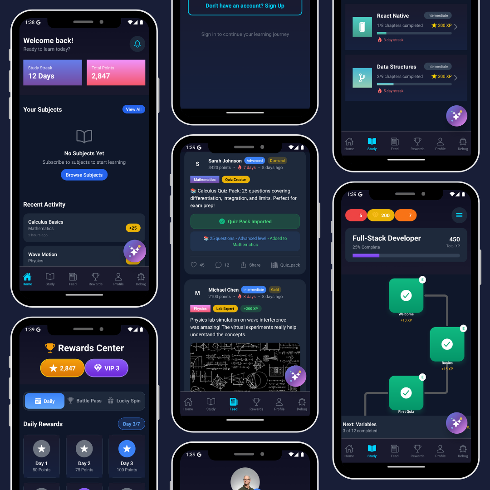

# Study Path 📚

A comprehensive gamified learning platform that transforms education into an engaging, interactive experience. Study Path combines course content, progress tracking, social interaction, and a robust gamification system to motivate learners across various subjects.



## 🌟 Features

### 📱 Core Learning Features
- **Multi-Subject Support**: Mathematics, Physics, Programming (React Native, Data Structures, Full-Stack Development)
- **Interactive Course Content**: Structured learning paths with chapters and modules
- **Progress Tracking**: Visual progress maps and completion indicators
- **Quiz System**: Multiple choice questions with instant feedback
- **Study Streaks**: Daily learning streaks to maintain consistency

### 🎮 Gamification System
- **Points & XP System**: Earn points for completing lessons and quizzes
- **Achievement Badges**: Bronze, Silver, Gold, and Diamond levels
- **Daily Rewards**: 7-day reward cycle with increasing benefits
- **Battle Pass**: Seasonal progression system
- **Lucky Spin**: Random reward opportunities

### 👥 Social Learning
- **Community Feed**: Share achievements and study materials
- **Quiz Pack Sharing**: Create and share custom quiz collections
- **User Profiles**: Track individual progress and achievements
- **Social Engagement**: Like, comment, and share learning content

### 🏆 Rewards Center
- **VIP System**: Tiered membership with exclusive benefits
- **Daily Challenges**: Special tasks for bonus rewards
- **Achievement Gallery**: Showcase your learning milestones

## 🛠️ Tech Stack

### Frontend
- **React Native** with Expo Router for cross-platform mobile development
- **TypeScript** for type-safe development
- **NativeWind** (Tailwind CSS) for styling
- **React Native Reanimated** for smooth animations
- **React Native Gesture Handler** for touch interactions

### Backend & Database
- **Supabase** for backend services and real-time features
- **PostgreSQL** database with comprehensive schema
- **Drizzle ORM** for type-safe database operations
- **Row Level Security (RLS)** for data protection

### Development Tools
- **ESLint & Prettier** for code quality
- **Expo CLI** for development and deployment
- **Vite** for web development
- **Database migrations** for schema management

## 📁 Project Structure

```
study-path/
├── src/
│   ├── app/                    # Expo Router pages
│   │   ├── (tabs)/            # Tab navigation screens
│   │   ├── auth/              # Authentication screens
│   │   └── study/             # Study-related screens
│   ├── components/            # Reusable UI components
│   ├── contexts/              # React contexts for state management
│   ├── lib/                   # Database and utility functions
│   ├── superbase/             # Supabase service layer
│   └── utils/                 # Helper utilities
├── web/                       # Web admin panel
├── supabase/                  # Database migrations and config
├── assets/                    # App icons and images
└── scripts/                   # Database and utility scripts
```

## 🚀 Getting Started

### Prerequisites
- Node.js (v18 or higher)
- Expo CLI (`npm install -g @expo/cli`)
- Supabase account and project

### Installation

1. **Clone the repository**
   ```bash
   git clone <your-repo-url>
   cd study-path
   ```

2. **Install dependencies**
   ```bash
   npm install
   ```

3. **Set up Supabase**
   - Create a new Supabase project
   - Copy your project URL and anon key
   - Run the database migrations:
     ```bash
     cd supabase
     supabase db reset
     ```

4. **Configure environment variables**
   - Copy `web/env.example` to `web/.env`
   - Add your Supabase credentials

5. **Start the development server**
   ```bash
   npm start
   ```

### Available Scripts

- `npm start` - Start Expo development server
- `npm run android` - Run on Android device/emulator
- `npm run ios` - Run on iOS device/simulator
- `npm run web` - Run web version
- `npm run lint` - Run ESLint

## 📊 Database Schema

The app uses a comprehensive PostgreSQL schema with the following main entities:

- **Users**: User profiles and authentication
- **Subjects**: Learning subjects (Math, Physics, etc.)
- **Topics**: Specific topics within subjects
- **Flows**: Learning paths and course structures
- **Flow Nodes**: Individual lessons and modules
- **MCQs**: Multiple choice questions
- **Quiz Packs**: Collections of questions
- **User Subscriptions**: User enrollment in subjects

## 🌐 Web Admin Panel

The project includes a comprehensive web admin panel (`/web`) for:
- Managing subjects and topics
- Creating and editing quiz content
- Building learning flows
- Managing user subscriptions
- Database administration

## 🎯 Key Features in Detail

### Learning Flow System
- Visual progress mapping
- Modular course structure
- Adaptive learning paths
- Completion tracking

### Gamification Elements
- **Points System**: Earn XP for various activities
- **Streaks**: Daily learning consistency rewards
- **Badges**: Achievement recognition system
- **VIP Levels**: Tiered membership benefits

### Social Features
- **Community Feed**: Share and discover content
- **Quiz Pack Creation**: Build and share custom quizzes
- **User Interactions**: Like, comment, and share
- **Progress Sharing**: Showcase achievements

## 🔧 Development

### Database Management
```bash
# Run migrations
npm run db:migrate

# Seed sample data
npm run db:seed

# Reset database
npm run db:reset
```

### Code Quality
- ESLint configuration for consistent code style
- Prettier for code formatting
- TypeScript for type safety
- Comprehensive error handling

## 📱 Platform Support

- **iOS**: Native iOS app with full feature support
- **Android**: Native Android app with Material Design
- **Web**: Progressive Web App for browser access
- **Admin Panel**: Full-featured web interface

## 🤝 Contributing

1. Fork the repository
2. Create a feature branch (`git checkout -b feature/amazing-feature`)
3. Commit your changes (`git commit -m 'Add amazing feature'`)
4. Push to the branch (`git push origin feature/amazing-feature`)
5. Open a Pull Request

## 📄 License

This project is licensed under the MIT License - see the [LICENSE](LICENSE) file for details.

## 🙏 Acknowledgments

- Built with [Expo](https://expo.dev/) and [React Native](https://reactnative.dev/)
- Backend powered by [Supabase](https://supabase.com/)
- Styling with [NativeWind](https://www.nativewind.dev/)
- Icons and UI inspiration from modern learning platforms

---

**Study Path** - Making learning an adventure! 🚀📚